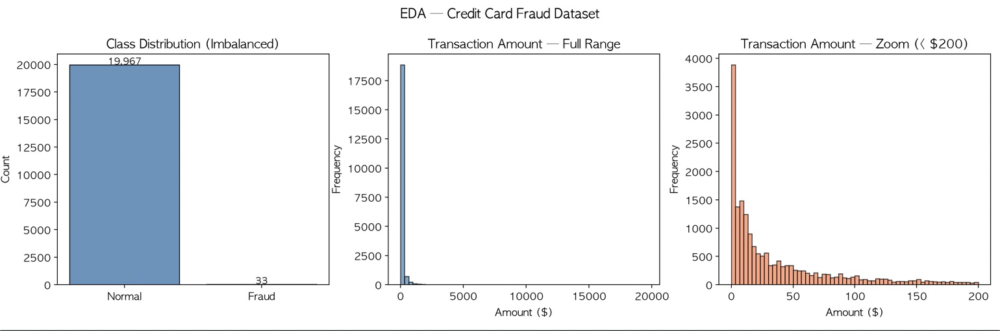
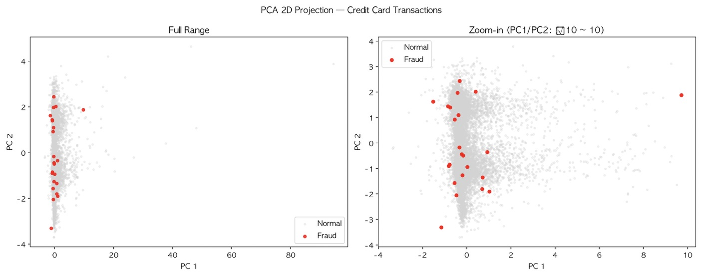
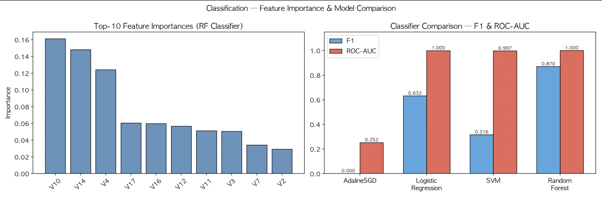
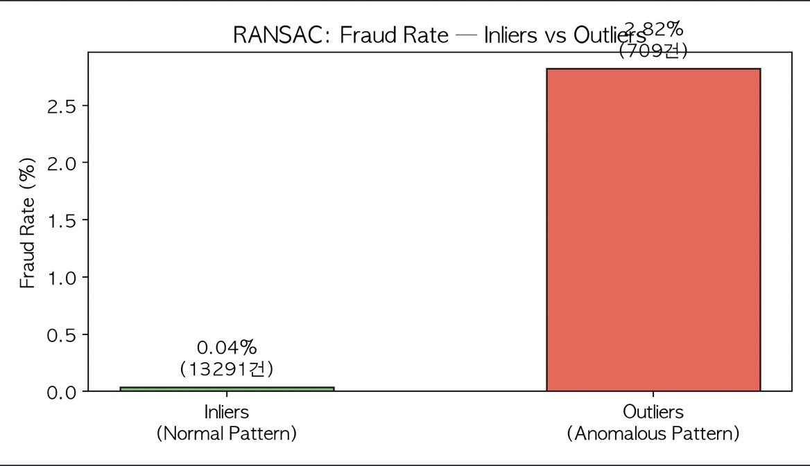
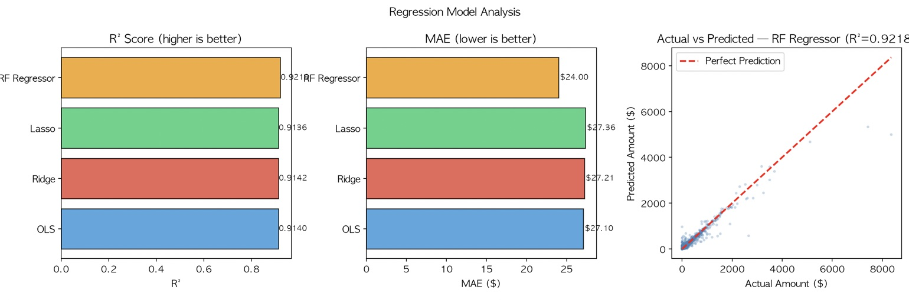
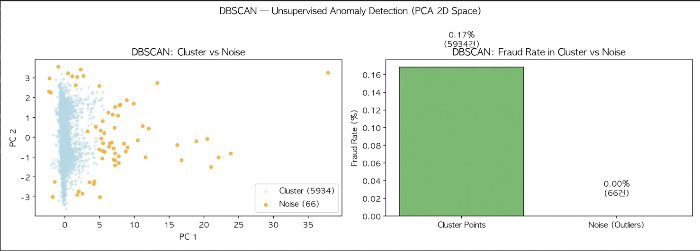
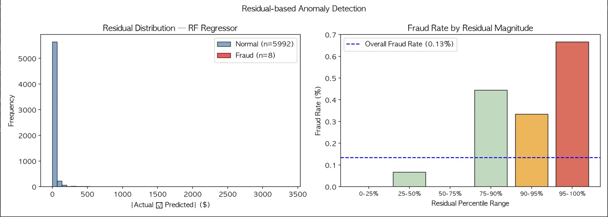

# Credit Card Fraud Detection — ML Pipeline

Kaggle의 신용카드 사기 탐지 데이터셋을 가지고 분류, 회귀, 비지도 학습을 전부 써보면서 만든 파이프라인입니다. 수업 도중 배운 내용들을 실제 데이터에 적용해보는 게 목적이었고, 최종적으로 배운 내용을 거의 다 적용하였습니다. 

---

## 데이터셋

Kaggle — [Credit Card Fraud Detection](https://www.kaggle.com/datasets/mlg-ulb/creditcardfraud)

`creditcard.csv` 파일을 프로젝트 루트에 놓고 실행하면 됩니다. 파일이 꽤 크기 때문에 코드 내에서 20,000건만 샘플링해서 씁니다.

- 전체 피처: V1~V28 (PCA로 익명화된 값), Time, Amount
- 타겟: Class (0=정상, 1=사기)
- 사기 비율: 약 0.17% — 심각한 클래스 불균형

---

## 실행 환경

```
Python 3.8 이상
numpy
pandas
matplotlib
scikit-learn
```

```bash
pip install numpy pandas matplotlib scikit-learn
python final_project.py
```

OS별 한글 폰트를 자동으로 잡도록 해뒀습니다 (macOS: AppleGothic, Windows: Malgun Gothic, Linux: DejaVu Sans).

---

## 파이프라인 구조

총 7개 파트로 이루어져 있습니다. 위에서부터 순서대로 실행됩니다.

### PART 1 — EDA

데이터를 불러오고 기본적인 탐색을 합니다. 클래스 불균형이 얼마나 심한지, 거래 금액 분포가 어떻게 생겼는지 시각화합니다.



보면 알겠지만 정상 거래가 19,967건인데 사기 거래는 33건입니다. 이 불균형이 이후 모든 모델 선택에 영향을 줍니다. 금액 분포는 오른쪽으로 심하게 치우쳐 있고, $50 미만 거래가 전체의 60% 이상입니다.

여기서 데이터를 두 가지 형태로 분할해 놓습니다.
- 분류용: X_clf (V1~V28 + Time + Amount), y_clf (Class) — Stratified 분할
- 회귀용: X_reg (V1~V28 + Time), y_reg (Amount)

---

### PART 2 — PCA 2D 차원 축소

30개 피처를 2차원으로 압축해서 사기 거래가 선형적으로 분리되는지 눈으로 확인합니다.



결론부터 말하면 잘 안 됩니다. 사기 거래(빨간 점)가 정상 거래 클러스터 안에 섞여 있어서 선형 모델만으로는 한계가 있다는 게 보입니다. 이 PCA 변환 객체는 PART 5 DBSCAN에서도 그대로 재사용됩니다.

---

### PART 3 — 분류 모델

4가지 분류 모델을 학습하고 F1, ROC-AUC로 비교합니다. 불균형 데이터라서 정확도(Accuracy)는 의미가 없고 F1이나 AUC를 봐야 합니다.



**AdalineSGD (baseline)**
- `SGDClassifier(loss='squared_error')`로 구현 — Adaline과 수학적으로 동일
- F1: 0.000, AUC: 0.252
- 예상대로 거의 못 잡음. 기준선 역할

**Logistic Regression**
- L2 정규화, C 값 GridSearch (0.01 / 0.1 / 1.0 / 10.0)
- F1: 0.632, AUC: 1.000
- 생각보다 AUC가 잘 나옴

**SVM (rbf kernel)**
- `class_weight='balanced'` 설정이 중요 — 안 하면 사기 거래를 거의 못 잡음
- C, gamma GridSearch
- F1: 0.316, AUC: 0.997

**Random Forest**
- `class_weight='balanced'` + n_estimators, max_depth GridSearch
- F1: 0.870, AUC: 1.000
- 전체적으로 가장 좋은 성능

중요 변수는 V10, V14, V4 순서로 높게 나왔습니다.

---

### PART 4 — 회귀 모델 (거래 금액 예측)

Amount를 타겟으로 두고 회귀 모델을 학습합니다. 여기서 Class는 피처에서 제외합니다. 이유는 PART 6에서 설명하는 잔차 분석을 하기 위해서입니다.

**OLS (Linear Regression)** — baseline
- R²: 0.9140

**RANSAC**



이상치를 제외하고 학습하는 로버스트 회귀입니다. 예측 성능보다는 RANSAC이 이상치로 분류한 거래 중 실제 사기 비율이 높은지를 확인하는 게 목적입니다. 결과를 보면 Inlier(정상 패턴) 그룹의 사기 비율은 0.04%인데, Outlier 그룹에서는 2.82%로 약 70배 높게 나왔습니다.



**Ridge / Lasso**
- Ridge (best alpha 그리드서치): R² 0.9142
- Lasso (best alpha 그리드서치): R² 0.9136
- Lasso는 불필요한 변수를 0으로 만드는 자동 변수 선택이 됩니다

**Random Forest Regressor**


R²: 0.9218로 가장 높습니다. 금액 예측에 중요한 변수는 V7, V2, V20 순서였는데, 분류에서 중요했던 V10, V14와는 다른 변수들이 올라왔습니다. 분류(사기 여부)와 회귀(금액 크기)가 서로 다른 패턴을 본다는 게 흥미롭습니다.

---

### PART 5 — DBSCAN 비지도 이상치 탐지

레이블 없이 밀도 기반 군집화로 이상치를 탐지합니다. PCA 2D 공간에서 수행합니다.



결과가 좀 애매하게 나왔습니다. Cluster 포인트의 사기 비율이 0.17%인 반면, Noise로 분류된 포인트의 사기 비율은 0.00%입니다. DBSCAN 파라미터(eps, min_samples)에 따라 결과가 많이 달라지고, PCA 2D로 압축한 공간에서는 사기 거래가 특별히 밀도 낮은 위치에 있지 않다는 의미이기도 합니다. RANSAC과 비교하면 DBSCAN은 이 데이터에서는 효과적이지 않았습니다.

---

### PART 6 — 잔차 기반 이상 거래 탐지

핵심 아이디어는 이렇습니다. 정상 거래 패턴으로 학습한 모델이 특정 거래의 금액을 크게 틀렸다면, 그 거래는 일반적인 패턴을 따르지 않는다는 뜻이고 사기일 가능성이 있습니다.



실제로 잔차 상위 5% 구간의 사기 비율은 전체 평균(0.13%)의 5배 이상으로 올라갑니다. 잔차가 클수록 사기 비율이 높아지는 경향이 있어서, 회귀 잔차를 보조 신호로 쓸 수 있다는 게 확인됩니다.

---

### PART 7 — 종합 대시보드

전체 파트의 결과를 한 화면에 정리합니다. 실행하면 `fraud_detection_summary.png`로 저장됩니다.


---

## 결과 요약

| 구분 | 모델 | 지표 |
|------|------|------|
| 분류 최고 | Random Forest | F1=0.870, AUC=1.000 |
| 분류 차선 | Logistic Regression | F1=0.632, AUC=1.000 |
| 회귀 최고 | RF Regressor | R²=0.9218 |
| 이상치 탐지 | RANSAC Outlier | 사기 비율 2.82% (전체 평균의 약 21배) |

---

## 결론 

본 프로젝트를 진행하면서 단일 분류 모델의 한계를 극복하기 위해 회귀 분석(잔차 기반)과 비지도 학습을 병행하여 사기 탐지의 신뢰성을 높일 수 있음을 보여주었고
사기 비율이 높은 '이상 거래'를 사전에 필터링하는 파이프라인을 구축함으로써, 실제 금융 현장에서 발생할 수 있는 탐지 누락을 보완할 가능성을 확인하였으며,
단순히 수치를 맞추는 모델이 아니라, 어떤 특징이 사기 거래를 유발하는지 분석함으로써 사기 패턴 변화에 대응할 수 있는 발판을 마련하였습니다.

## 파일 구조

```
.
├── final_project.py              # 메인 코드
├── creditcard.csv                # 데이터셋 (직접 다운로드 필요)
├── fraud_detection_summary.png   # 실행 후 생성되는 대시보드 이미지
└── README.md
```

---

## 메모

- 샘플을 20,000건으로 제한해서 쓰는데, 전체 데이터(약 284,000건)로 돌리려면 `df_sampled = df` 로 바꾸면 됩니다. GridSearch에 시간이 꽤 걸립니다.
- SVM은 데이터 크기에 민감해서 전체 데이터로 돌리면 매우 느립니다.
- DBSCAN의 eps, min_samples는 데이터 스케일에 따라 결과가 많이 달라지므로 튜닝 여지가 있습니다.
